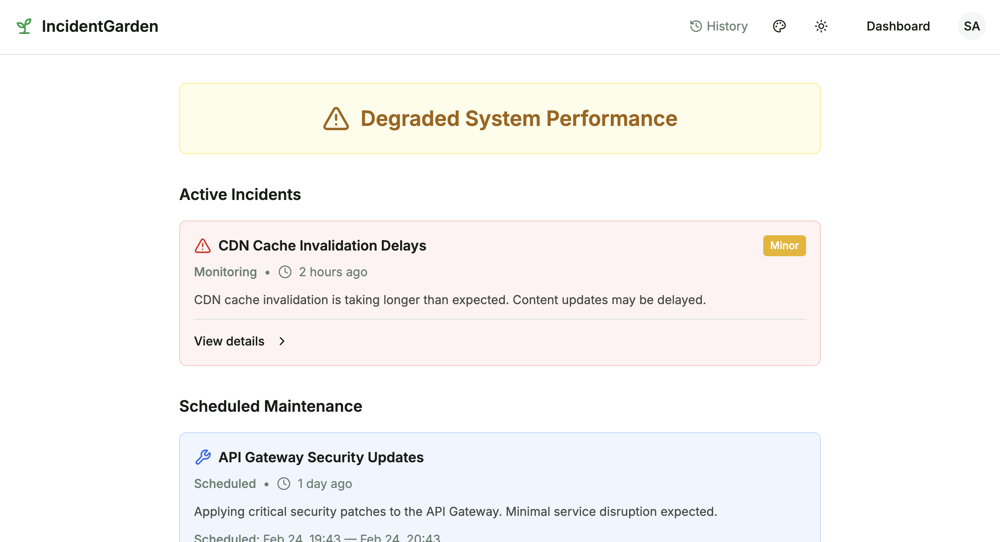

# IncidentGarden

Open-source incident communication platform for service status pages.
A self-hosted alternative to Atlassian Statuspage and PagerDuty Status Page.

[](https://github.com/bissquit/incident-garden/actions/workflows/ci.yml)
[](https://go.dev)
[](./api/openapi/openapi.yaml)
[](./LICENSE)

<p align="center">
  
</p>

> UI is provided by [Garden UI](https://github.com/bissquit/garden-ui) — a separate frontend project built on top of the IncidentGarden API.

## Why IncidentGarden

The open-source status page landscape is split: monitoring tools (Uptime Kuma, Gatus) detect problems but don't help communicate them to users. Static pages (cState, Upptime) display status but lack incident management. Commercial platforms (Statuspage, BetterStack) do both — for $99-1499/month.

IncidentGarden fills the gap: a **full incident communication lifecycle** in an open-source, self-hosted package.

- **Incident lifecycle with audit trail** — not just open/close, but `investigating` > `identified` > `monitoring` > `resolved`, with every service change tracked
- **Effective status auto-computed** — worst-case across all active events, per service. No manual status juggling
- **Subscriber notifications** — users subscribe to specific services and get notified via Email, Telegram, or Mattermost. Not just admin alerts — user-facing communication
- **Production-ready from day one** — Prometheus metrics, pre-built alerts, Kubernetes probes, structured logging, graceful shutdown. No "add monitoring later"

## Not a Monitoring Tool

IncidentGarden is an incident communication platform, not an uptime monitor. It handles what happens **after** an issue is detected: status tracking, timeline updates, and subscriber notifications.

Pair it with your existing monitoring stack — Prometheus, Uptime Kuma, Grafana, or any tool that detects problems. IncidentGarden handles the communication.

## Features

**Status Page**
- Public status page with real-time service statuses
- Service groups with M:N membership
- 5 status levels: `operational`, `degraded`, `partial_outage`, `major_outage`, `maintenance`
- Status history and audit log

**Incident & Maintenance Management**
- Full incident lifecycle: `investigating` > `identified` > `monitoring` > `resolved`
- Scheduled maintenance: `scheduled` > `in_progress` > `completed`
- Severity levels: `minor`, `major`, `critical`
- Per-incident affected services with granular status overrides
- Add/remove services on the fly during an active incident
- Event templates for consistent communication
- Complete audit trail of every change (who, when, what)

**Notifications**
- 3 channels: Email (SMTP), Telegram (Bot API), Mattermost (webhooks)
- Per-service subscriptions — users choose what they care about
- Channel verification (email codes, Telegram /start, Mattermost test message)
- Async delivery queue with retry mechanism
- Default email channel auto-created on registration

**Access Control**
- Three roles: `user` (subscribe) > `operator` (manage incidents) > `admin` (full control)
- JWT authentication with refresh tokens

**Operations**
- Prometheus metrics on `/metrics` (port 9090)
- Pre-configured alerts: error rate, latency, DB pool, memory, goroutine leaks
- Health (`/healthz`) and readiness (`/readyz`) probes
- Structured JSON logging via slog
- Graceful shutdown

## Quick Start

Requirements: Docker and Docker Compose.

```bash
git clone https://github.com/bissquit/incident-garden.git
cd incident-garden
cp .env.example .env
make docker-build && make docker-up
```

Verify it's running:

```bash
curl http://localhost:8080/healthz       # OK
curl http://localhost:8080/api/v1/status  # system status JSON
```

Interactive API docs are available at http://localhost:8080/docs, OpenAPI spec at http://localhost:8080/api/openapi.yaml.

For the full visual experience, set up [Garden UI](https://github.com/bissquit/garden-ui) — a frontend that connects to the IncidentGarden API.

### Pre-built Images

```bash
docker pull ghcr.io/bissquit/incident-garden:latest
```

Available for `amd64` and `arm64`.

### Test Users (Development Only)

| Email | Password | Role |
|---|---|---|
| admin@example.com | admin123 | admin |
| operator@example.com | admin123 | operator |
| user@example.com | user123 | user |

## API-First Architecture

IncidentGarden is designed as an API-first platform. The backend is a standalone product — Garden UI is one client, but you can build your own.

- **OpenAPI 3.0 specification** — versioned independently from the application
- **Spec served at runtime** — `GET /api/openapi.yaml` always returns the current contract
- **Interactive docs** — Swagger UI at `/docs`
- **Consistent response format** — `{"data": {...}}` for success, `{"error": {"message": "..."}}` for errors

Build on top of it: custom dashboards, CLI tools, ChatOps bots, Grafana panels, CI/CD integrations.

## Comparison

IncidentGarden vs projects in the same niche — incident communication platforms (not monitoring tools):

|                               | IncidentGarden                 | Cachet v3              | OpenStatus |
|-------------------------------|--------------------------------|------------------------|------------|
| Project status                | Active                         | Stalled (1 maintainer) | Active     |
| Incident lifecycle            | Full (4 states + audit trail)  | Basic                  | Basic      |
| RBAC                          | user / operator / admin        | Partial                | No         |
| Subscriber notifications      | Email, Telegram, Mattermost    | Email only             | Email      |
| Per-service subscriptions     | Yes                            | No                     | No         |
| Event templates               | Yes                            | Yes (Twig)             | No         |
| Affected services per incident | Multiple, editable on the fly  | 1 component            | Multiple   |
| API contract                  | OpenAPI 3.0, versioned (v2.12) | Yes                    | Yes        |
| Self-host complexity          | Go binary + PostgreSQL         | PHP + Laravel + DB     | 6 services |
| License                       | AGPL-3.0                       | BSD-3                  | AGPL-3.0   |

> Uptime Kuma, Gatus, and similar tools are **monitoring solutions**, not incident communication platforms. They complement IncidentGarden rather than compete with it.

## Tech Stack

| Part        | Tool/Technologie                |
|-------------|---------------------------------|
| Language    | Go 1.25                         |
| HTTP Router | chi                             |
| Database    | PostgreSQL 16                   |
| Migrations  | golang-migrate                  |
| Logging     | slog (stdlib)                   |
| Metrics     | Prometheus                      |
| CI/CD       | GitHub Actions, GoReleaser      |
| Containers  | Docker (Alpine 3.19, multi-arch) |

## Documentation

- [Deployment Guide](./docs/deployment.md) — environment variables, Kubernetes manifests, Prometheus setup
- [OpenAPI Specification](./api/openapi/openapi.yaml) — full API contract
- [Changelog](./CHANGELOG.md) — release history

## Development

```bash
# Local development (PostgreSQL in Docker, app with hot-reload)
make docker-postgres
make dev

# Quality checks
make lint
make test
make test-integration

# Database migrations
make migrate-up
make migrate-down
make migrate-create NAME=add_something
```

See `make help` for all available commands.

## Contributing

Contributions are welcome. Please create issues and pull requests.

## License

[GNU Affero General Public License v3.0](./LICENSE)
